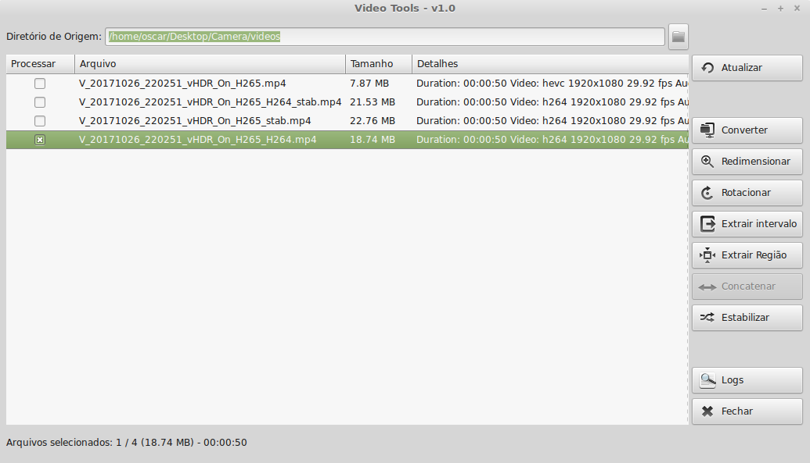
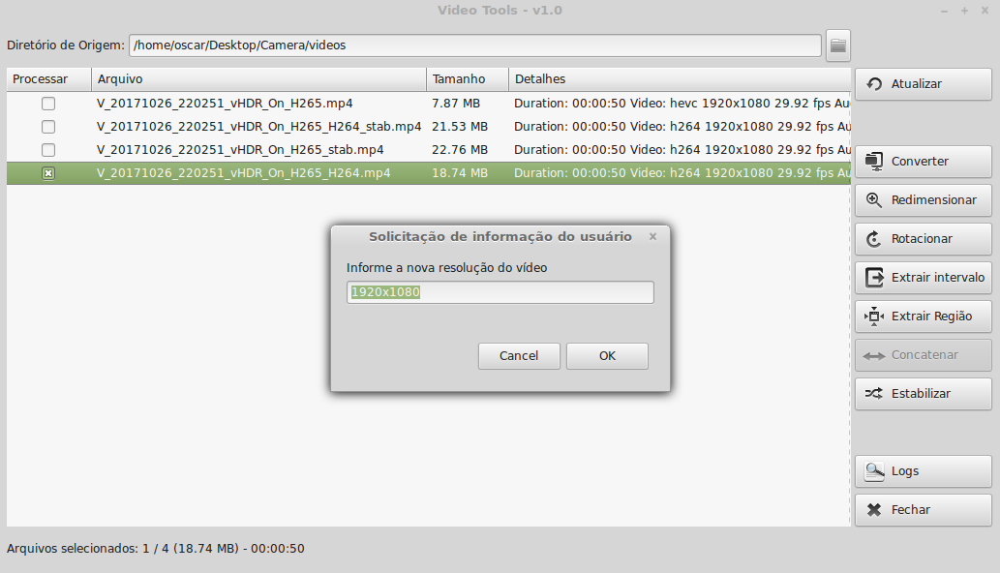
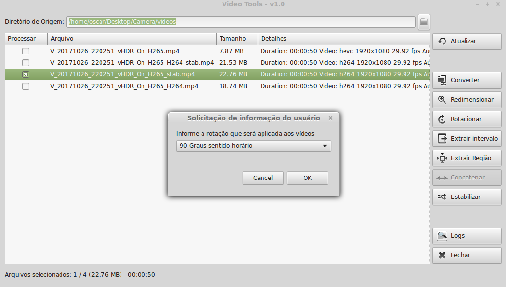

# Utilitário para transformação de arquivos de vídeo

Esse aplicativo foi desenvolvido em Python com o objetivo de facilitar o processo de modificação de videos utilizando o utilitário [ffmpeg](https://www.ffmpeg.org/).  
Dado um diretório, o aplicativo irá localizar e exibir as informações dos vídeos presentes em seus sub-diretórios.  
Do lado direito lista de arquivos, a aplicação possúi uma barra com as transformações que podem ser aplicadas aos arquivos selecionados.  
Esse aplicativo é compatível com Python 2.X e 3.X, e pode ser executado tanto no Linux quanto no Windows.  

**Importante:** Para suporte ao Codec H265 e estabilização, pode ser necessário recompilar o ffmpeg, habilitando o codec H265 e a biblioteca vidstab, seguindo os passos descritos no [guia de compilação oficial do ffmpeg](https://trac.ffmpeg.org/wiki/CompilationGuide) e o site da [biblioteca vidstab](https://github.com/georgmartius/vid.stab).

## Requisitos

Para o completo funcionamento da aplicação é necessário que as seguintes ferramentas estejam instaladas no sistema:

1. Python `2.7` ou `3.5`.
2. Bibliotecas do python: LXML, future e GTK3.
3. Conversor de mídias ffmpeg no path do sistema ou confiurado no arquivo `settings.xml`.

## Instalação dos Requisitos

### Linux

1 - Instalar o Python e o PyPI:

```sh
sudo apt-get install python-pip
```

2 - Usando o pyton-pip, instalar a biblioteca `lxml` e `future`:

```sh
sudo pip install lxml
sudo pip install future
```

**Nota:** No Linux não será necessário instalar o GTK3.

### Windows

1 - Instalar o [Python 2.7](https://www.python.org/downloads/release/python-2713/).

**Importante:** Durante a instalação, lembrar de marcar a opção para adicionar o Python ao Path do sistema ou adicionar manualmente a variável de ambiente PATH.

- Instalação do Python


2 - Instalar o [PyGObject for Windows](https://sourceforge.net/projects/pygobjectwin32/files/pygi-aio-3.18.2_rev12-setup_549872deadabb77a91efbc56c50fe15f969e5681.exe/download)

**Importante:** Durante a instalação, os seguintes componentes devem ser selecionados: `Base Packages` e `GTK+ 3.18.9` (ver imagens).

- Seleção do diretório onde o Python 2.7 está instalado


- Seleção da versão do Python 2.7

**Nota:** Se a mesma versão aparecer mais de uma vez, selecionar apenas uma.


- Seleção dos componentes básicos


- Seleção dos GTK3+


- Ignora pacotes não GNU


- Ignora pacotes adicionais


- Confirma a instalação


3 - Usando o python pip via Linha de Comando, instalar a biblioteca `lxml` e `future`:

```sh
pip install lxml
pip install future
```

## Utilização do aplicativo

Tela principal do sistema, onde o usuário pode especificar o diretório de origem, selecionar os arquivos e a opção de transformação dos vídeos.  



Após selecionar o diretórios de origem, o usuário deve clicar em **Atualizar**; A aplicação irá pesquisar os arquivos de vídeo na árvore dos sub-diretórios, exibindo as informações dos vídeos na lista de arquivos, informando o nome, tamanho, detalhes do codec e possibilitando a seleção para a transformação.  
Após selecionar os vídeos que devem ser processados, o usuário deve clicar no botão desejado para executar a operação.  
Um menu popup está disponível para facilitar a seleção e exclusão na lista de arquivos.  

## Formatos suportados

A aplicação suporta a leitura de diversos formatos de vídeo, entre eles os arquivos wmv, avi, mpg, 3gp, mov, m4v, mts, mp4 e webm.  

Para escrita, o seguintes codecs são suportados:

1. Codecs de Vídeo
    + H265 HEVC - MPEG (Container) + H265 (Video) + AAC (Audio)  **__Melhor compressão__**
    + H264 AVC - MPEG (Container) + H264 (Video) + AAC (Audio)  **__Maior compatibilidade__**
    + WebM VP8 - Matroska (Container) + VP8 (Video) + Vorbis (Audio)  
    + WebM VP9 - Matroska (Container) + VP9 (Video) + Opus (Audio)

1. Codecs de Audio
    + MP3  
    + AAC  
    + FLAC  
    + Ogg Vorbis  

**OBS:** A lista de codecs suportados irá variar dependendo do suporte do ffmpeg.

## Funcionalidades

A seguir, a lista de funcionalidades disponíveis na aplicação.  

### Converter

Possibilita a conversão dos vídeos selecionados para um codec especificado e exportação da faixa de audio.  
Ao ser clicado, uma tela será exibida com a lista de codecs suportados pelo ffmpeg que se encontra configurado na aplicação.  
Após a confirmação, a aplicação irá iniciar o processo de conversão e exibir uma tela, com o progresso da atividade.  
O arquivo convertido será gerado no diretório da tela inicial e terá um prefixo com o nome do codec e a extensão do codec.  

**Nota:** Caso seja selecionado um dos codecs de audio, a aplicação irá extrair apenas a faixa de áudio.


### Redimensionar

Possibilita a mudança da resolução dos vídeos selecionados, reduzindo o tamanho do arquivo de vídeo.  
Uma tela será exibida solicitando a nova resolução, com a resolução do primeiro video selecionado preenchida como padrão.  



### Rotacionar

Possibilita a rotação e aplicação de inversão (flip) dos vídeos selecionados.  

As seguintes opções estão disponíveis:  
+ 90 Graus sentido horário
+ 90 Graus sentido anti-horário
+ 180 Graus
+ 90 Graus sentido anti-horário com flip vertical
+ 90 Graus sentido horário com flip vertical
+ Flip horizontal
+ Flip vertical



### Extrair intervalo

Essa funcionalidade possibilita criar um vídeo a partir de um intervalo do video selecionado.  
Será exibido uma tela com o tempo inicial e o tempo final do trecho que deve ser extraído, por padrão o trecho final irá exibir o tamanho total do video.  


**Nota:** Essa funcionalidade só estará diponível se apenas um video estiver selecionado na lista.  

### Extrair Região

Possibilita criar um vídeo com uma região do vídeo original (crop).  
Será exibida uma tela com a posição inicial (vertical e horizontal) e o tamanho (largura e altura) da seção que deve ser capturada.  


**Nota:** Essa funcionalidade só estará diponível se apenas um video estiver selecionado na lista.  

### Concatenar

Possibilita criar um vídeo a partir de uma sequencia de videos (concatenar vídeos).  
Uma tela será exibida com a lista de videos que serão concatenados e o codec do vídeo de destino.  
A sequencia dos videos será a sequencia dos arquivos na caixa de texto.  


**Nota:** Essa funcionalidade só estará diponível se mais de um video estiver selecionado na lista.

### Estabilizar

Possibilita a estabilização de vídeos (deshake).  
Essa é uma funcionalidade experimental que permite a correção de vídeos sem estabilização (tremidos).  


**Nota:** Essa funcionalidade só estará diponível se o ffmpeg estiver compilado com a opção `--enable-libvidstab` ver detalhes no site da [biblioteca VidStab](https://github.com/georgmartius/vid.stab) .  

## Arquivo de configuração e log da aplicação

### Configuração

As configurações da aplicação estão no arquivo `settings.xml`, o arquivo possui a seguinte sintaxe:

```xml
<?xml version='1.0' encoding='UTF-8'?>
<config>
	<extensoes_video>wmv|avi|mpg|3gp|mov|m4v|mts|mp4|webm</extensoes_video>
	<caminho_ffmpeg>ffmpeg</caminho_ffmpeg>
	<dir_origem>/home/oscar/Desktop/Camera/videos</dir_origem>
</config>
```

A seção `extensoes_video` define a lista de arquivos que devem ser considerados pela aplicação. A aplicação considera tanto texto em maiúsuculo quanto em minusculo.  
A seção `caminho_ffmpeg` indica a localização do ffmpeg. Caso não seja especificado o diretório, será considerado a aplicação que estiver no path do sistema.  
A seção `dir_origem` indica o último diretório selecionado na aplicação.

### Log

Durante a execução, a aplicação irá gerar um log no arquivo `application.log`. Esse arquivo pode ser visualizado ao clicar o botão `Logs` da tela inicial.
